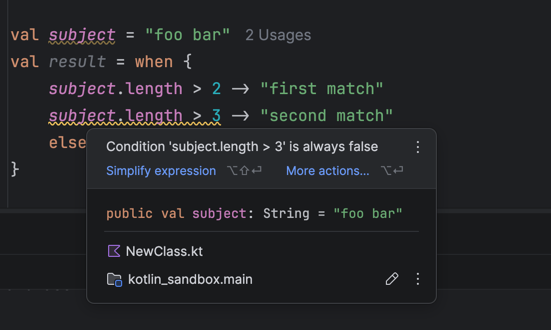

# What to test (draft)

## 'green' cases

* Statement without subject, with matching case inside top-level declaration - 'a match' is printed:

```kotlin
fun main() {
    when {
        false -> println("not_match")
        true -> println("a match")
    }
}
```

* Expression with subject, with matching case inside top-level declaration - 'a match' is assigned to result:

```kotlin
fun main() {
    val subject = Random.nextInt()
    val result = when (subject) {
        1 -> "not a match"
        subject -> "a match"
        else -> "else"
    }
}
```

* Expression with subject, without matching case outside top-level declaration - 'else' is assigned to result:

```kotlin
val subject = "foobar"
val result = when (subject) {
    "bar" -> "not a match"
    "foo" -> "still not a match"
    else -> "else"
}
```

* Statement with subject variable non-exhaustive - no compilation/runtime errors:

```kotlin
fun main() {
    val subject = "foobar".substring(3)
    when (subject) {
        "foo" -> println("not a match")
        "oof" -> "not match"
    }
}
```

* Statement with subject literal - 'a match' is printed:

```kotlin
fun main() {
    when ("foo") {
        "foo" -> println("a match")
        "oof" -> println("not match")
    }
}
```

* Expression without variable assignment - no compilation/runtime errors:

```kotlin
val subject = "foobar"
when (subject) {
    "bar" -> "not a match"
    "foo" -> "still not a match"
    else -> "else"
}
```

* Expression exhaustive with enum subject - 'result' is assigned with matching value:

```kotlin
val enumSubject = SubjectOption.entries.random()
val result = when (enumSubject) {
    SubjectOption.ONE -> 1
    SubjectOption.TWO -> 2
    SubjectOption.THREE -> 3
}
```

* Expression exhaustive with boolean - 'result' is assigned with matching value:

```kotlin
val bool = Random.nextDouble(until = 1.0) <= 0.5
val result = when (bool) {
    true -> 1
    false -> 2
}
```

* Expression exhaustive with sealed class - 'result' is assigned with matching value:

```kotlin
sealed interface Sealed
class FirstSealed : Sealed
class SecondSealed : Sealed

fun main() {
    val subject = listOf(FirstSealed(), SecondSealed()).random()
    val result = when (subject) {
        is FirstSealed -> println("First sealed")
        is SecondSealed -> println("Second sealed")
    }
}
```

* Statement with case duplicate - no compilation/runtime errors, first matched value is printed to console:

```kotlin
fun main() {
    val bool = Random.nextDouble(until = 1.0) <= 0.5
    when (bool) {
        true -> println(1)
        false -> println(2)
        true -> println(3)
        false -> println(4)
    }
}
```

* Expression with cases returning same type - result type is resolved to values type:

```kotlin
val bool = Random.nextDouble(until = 1.0) <= 0.5
val result = when (bool) {
    true -> "String1"
    false -> "String2"
}
```

* Expression with cases returning different types - result type is resolved with Any (closest common type):

```kotlin
val subject = "foo"
val result = when (subject) {
    "bar" -> "String"
    "foo" -> println("Unit")
    else -> 1
}
```

* Expression with subject and only 'else' case - result is assigned with 'only else':

```kotlin
val result = when ("subject") {
    else -> "only else"
}
```

* Statement with single-line block - no compilation/runtime errors, 'block' is printed:

```kotlin
fun main() {
    when {
        "foo".length <= 3 -> {
            println("block")
        }
    }
}
```

* Expression with multi-line block - result is assigned with 'match':

```kotlin
val result = when {
    "foo".length < 3 -> {
        println("match detected")
        "match"
    }

    else -> "not a match"
}
```

* With exception throw:

```kotlin
fun main() {
    when {
        Random.nextDouble(until = 1.0) < 2.0 -> throw Exception()
    }
}
```

* Nested where block - matching case from nested when is invoked:

```kotlin
fun main() {
    val value = Random.nextInt()
    when {
        true -> when (value) {
            4 -> println("4")
            else -> println("3 or less")
        }
    }
}
```

* Multiple matches (TODO - clarify a warning) - result is assigned with the first match:

```kotlin
val subject = "foo bar"
val result = when {
    subject.length > 2 -> "first match"  // to be matched
    subject.length > 3 -> "second match"
    else -> "else"
}
```

Potential bug - IDE shows irrelevant warning for the second match:

IDE build: Build #IU-253.30387.90
Project kotlin version: 2.3.0

* Case with value from function - no compilation errors, result is assigned with matching case value:

```kotlin
fun randomInt(): Int = Random.nextInt()

val result = when {
    randomInt() > 2 -> "> 2"
    else -> "else"
}
```

* Multiple conditions (coma separated) - result is assigned with matching case value:

```kotlin
fun main() {
    val subject = "1"
    val result = when (subject) {
        "2", "1" -> "match"  // to be matched
        "3" -> "not a match"
        else -> "else"
    }
}
```

* Multiple match in multiple conditions - result is assigned value from first matching case:

```kotlin
fun main() {
    val subject = 1
    val result = when (subject) {
        5 -> "not match"
        1, 2 -> "first match" // to be matched
        3, 1 -> "second match"
        4 -> "not match"
        else -> "else"
    }
}
```

* Subject with 'in' range match - 'matched range' is assigned to result:

```kotlin
val subject = 2
val result = when (subject) {
    in 0..4 -> "matched range"
    else -> "not matched"
}
```

* Subject with '!in' range match - 'matched range' is assigned to result:

```kotlin
val subject = 4
val test = when (subject) {
    in 5..10 -> "not matched range"
    !in 5..10 -> "matched range"
    else -> "not matched"
}
```

* Variable declaration within the subject - 'foo' is printed out:

```kotlin
fun main() {
    when (val value = "foo") {
        value -> println("foo")
        "bar" -> println("bar")
    }
}
```

* Guard statement with single boolean - 'a match' is assigned to result:

```kotlin
val value = "foo"
val result = when (value) {
    value if value.length > 5 -> "not a match"
    value if value.length < 5 -> "a match"
    else -> "else"
}
```

* Guard statement with boolean expression - 'a match' is printed out:

```kotlin
fun main() {
    val value = "foo"
    when (value) {
        value if value.length > 5 || true -> println("a match")
        value if value.length < 5 && true -> println("not a match")
        else -> println("else")
    }
}
```

* Match with null case - 'a match' is printed out:

```kotlin
fun main() {
    val value: Int? = null
    when (value) {
        null -> println("a match")
        else -> println("else")
    }
}
```

* Guard with 'in' range - 'a match' is printed out:

```kotlin
fun main() {
    val value: Int = Random.nextInt()
    when (value) {
        in 1..5 if value < 3 -> println("a match")
        else -> println("else")
    }
}
```

* Guard is executed on match only - 'func is executed with foo\namatch' is printed out:

```kotlin
fun func(parameter: String): Boolean {
    println("func is executed with $parameter")
    return true
}

fun main() {
    val value = "foo"
    when (value) {
        "bar" if func("bar") -> println("not a match")
        "foo" if func("foo") -> println("a match")
        else -> println("else")
    }
}
```

* Return from when block - function returns 'from foo block':

```kotlin
fun test(): String {
    when {
        "foo".length < 3 -> {
            return "from foo block"
        }
        else -> return "else"
    }
}
```

* trailing comma in case - no compilation/runtime error, result is assigned with 'match':

```kotlin
fun main() {
    val subject = 1
    val result = when (subject) {
        1, -> "match" // to be matched
        4 -> "not match"
        else -> "else"
    }
}
```

## Negative ('red') checks

* non-exhaustive with open type -
   see [snippet](compiler/fir/analysis-tests/testData/resolveWithStdlib/when/expressionNonExhaustiveWithOpenType.kt);
* else is not the last case - see [snippet](compiler/fir/analysis-tests/testData/resolveWithStdlib/when/misplacedElse.kt);
* when expression with empty block -
   see [snippet](compiler/fir/analysis-tests/testData/resolveWithStdlib/when/emptyExpressionWhenBlock.kt);
* without subject condition type mismatch -
   see [snippet](compiler/fir/analysis-tests/testData/resolveWithStdlib/when/withoutSubjectTypeMismatch.kt);
* with subject condition incompatible type -
   see [snippet](compiler/fir/analysis-tests/testData/resolveWithStdlib/when/withSubjectIncompatibleTypes.kt);
* boolean expression in where with subject -
   see [snippet](compiler/fir/analysis-tests/testData/resolveWithStdlib/when/booleanExpressionInWhenWithSubjectCase.kt);
* when with empty subject - see [snippet](compiler/fir/analysis-tests/testData/resolveWithStdlib/when/subjectWhenWithEmptySubject.kt);
* when with subject without block -
   see [snippet](compiler/fir/analysis-tests/testData/resolveWithStdlib/when/subjectWhenWithWithoutBrackets.kt);
* when with missing condition statement -
   see [snippet](compiler/fir/analysis-tests/testData/resolveWithStdlib/when/missingConditionStatement.kt);
* when keyword as a variable name -
    see [snippet](compiler/fir/analysis-tests/testData/resolveWithStdlib/when/whenKeywordAsVariableName.kt);
* when keyword as a function name -
    see [snippet](compiler/fir/analysis-tests/testData/resolveWithStdlib/when/whenKeywordAsFunctionName.kt);
* when keyword as a class name - see [snippet](compiler/fir/analysis-tests/testData/resolveWithStdlib/when/whenKeywordAsClassName.kt);
* when keyword as a enum entry name -
    see [snippet](compiler/fir/analysis-tests/testData/resolveWithStdlib/when/whenKeywordAsEnumEntry.kt);
* when as a type - see [snippet](compiler/fir/analysis-tests/testData/resolveWithStdlib/when/whenKeywordAsVariableType.kt);
* non-subject with range without argument - see [snippet](compiler/fir/analysis-tests/testData/resolveWithStdlib/when/nonSubjectWhenWithRangeWithoutArgument.kt);
* refer to outer variable in guard condition - see [snippet](compiler/fir/analysis-tests/testData/resolveWithStdlib/when/referOuterVariableInGuard.kt);
* use guard for multi-conditional case - see [snippet](compiler/fir/analysis-tests/testData/resolveWithStdlib/when/useGuardForMultipleConditionsCase.kt);
* non-exhaustive with enum - see [snippet](compiler/fir/analysis-tests/testData/resolveWithStdlib/when/expressionNonExhaustiveWithEnum.kt);
* non-exhaustive with sealed class - see [snippet](compiler/fir/analysis-tests/testData/resolveWithStdlib/when/expressionNonExhaustiveSealedClass.kt);
* non-exhaustive with boolean - see [snippet](compiler/fir/analysis-tests/testData/resolveWithStdlib/when/expressionNonExhaustiveBoolean.kt);
* two consecutive trailing commas - see [snippet](compiler/fir/analysis-tests/testData/resolveWithStdlib/when/twoConsecutiveTrailingCommasAtTheCaseEnd.kt);
* comma in the beginning of the case - see [snippet](compiler/fir/analysis-tests/testData/resolveWithStdlib/when/commaAtTheCaseBeginning.kt);
* condition statement contains only comma - see [snippet](compiler/fir/analysis-tests/testData/resolveWithStdlib/when/conditionStatementContainsOnlyComma.kt);

* when with subject outside of function:

```kotlin
val userRole = "Editor"
when (userRole) {
    "Viewer" -> print("User has read-only access")
    "Editor" -> print("User can edit content")
    else -> print("User role is not recognized")
} 
```
